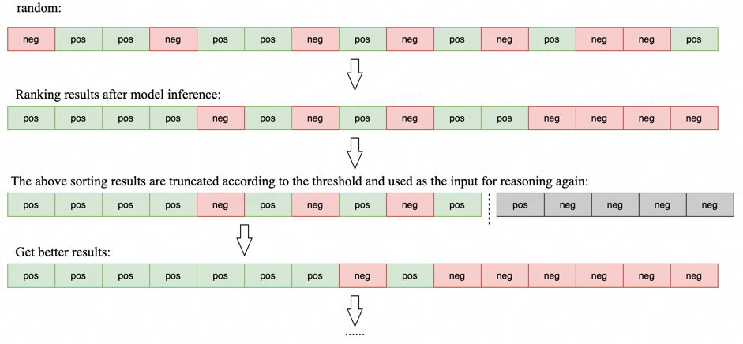

## WhoIsWho-IND-KDD-2024 solution

### Introduction
The rank1 solution on the test set for the WhoIsWho-IND task [Link](https://www.biendata.xyz/competition/ind_kdd_2024/).

This solution basically only uses LLM, and the base model is ChatGLM3-6b-32k. The key point of this solution is to iteratively increase the concentration of positive examples during inference.



This solution has high resource requirements, and 8*A100 is recommended.
### preparation
#### data
Download the dataset and place it in the folder `./data`.

#### requirements

```
pip install -r requirements
```


### Train
All weight files generated during training will be stored in the `./output` folder.
```bash
cd train
```

1.Only the title information is used:
```bash
sh scripts/train_title.sh
```

2.Only the author information is used:
```bash
sh scripts/train_author.sh
```

3.Use all the information:
```bash
sh scripts/train_all_info.sh
```

After the above three models are trained, a score of 0.832 can be achieved. The training benefits of the next two models are not high.

4.Only the title information is used, and the training data is downsampled:
```bash
sh scripts/train_title_downsample.sh
```

5.Only the author information is used, and the truncation length for a single sample is increased to 500:
```bash
sh scripts/train_author_len_500.sh
```


### Inference

All inference results are stored in the `./test_result` folder.
```bash
cd inference
```

```bash
sh scripts/inference_title_v0_seed42.sh
```

```bash
sh scripts/inference_title_v0_seed3407.sh
```

```bash
sh scripts/inference_author_v0.sh
```

```bash
python merge_v0.py
```

```bash
sh scripts/inference_title_v1.sh
```

```bash
sh scripts/inference_author_v1.sh
```

```bash
sh scripts/inference_all_info_v1.sh
```

```bash
python merge_v1.py
```

```bash
sh scripts/inference_title_v2.sh
```

```bash
sh scripts/inference_author_v2.sh
```

```bash
sh scripts/inference_all_info_v2.sh
```

```bash
sh scripts/inference_author_v2_len_500.sh
```

```bash
sh scripts/inference_title_v2_downsample.sh
```


```bash
python merge_v2.py
```


### Experiments
| results                           | score  |
|:----------------------------------|:------:|
| title_v0_seed42                   | 0.767  |
| author_v0_seed42                  | 0.788  |
| merge_title_author                | 0.807  |
| title_v1                          | 0.803  |
| author_v1                         | 0.800  |
| all_info_v1                       | 0.822  |
| merge_title_v1_author_v1          | 0.827  |
| merge_all_334                     | 0.8318 |
| merge_all_v2_334 +  merge_all_334 | 0.833  |
| final submit(Integrate an additional author model and a title model)                    | 0.8345 |

