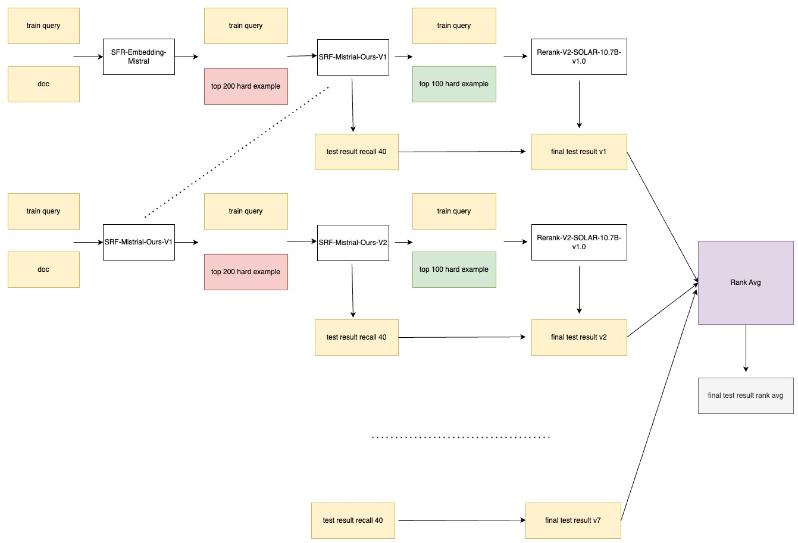

# OAG-AQA Rank 1 Solution

In this competition, we primarily employed hard example mining and iterative multi-path recall methods to achieve the final first-place result. The specific process is shown in the diagram below:



We first obtained hard examples using an open-source vector model (model used: SFR-Embedding-Mistral), then fine-tuned them through contrastive learning, and finally recalled the top 100 for rerank training (model used: SOLAR-10.7B). This single process scored 0.201 in the final test set.

Furthermore, we adopted an iterative pipeline to obtain a diverse set of models and results (we iterated through 7 rounds in total), ultimately achieving a score of 0.223 through rank average fusion.

# Prediction Process

##  Prerequisites
```
Linux
GPU Resources:8 A100 80G GPUs
python 3.8+
torch 2.3.0+cu121 (It may also be compatible with some lower versions.)
pip install -r requirements_infer.txt
```
## step1.Download data and model


(1).Download the LLM to the specified folder.
https://huggingface.co/Salesforce/SFR-Embedding-Mistral<br>
https://huggingface.co/upstage/SOLAR-10.7B-Instruct-v1.0<br>
a.Place these two models in the ./model_save folder.<br>
b.Download the LoRa parameters from here(https://modelscope.cn/models/sayoulala/KDDCup2024_task3_model/files) and place them in the ./model_save folder.
<br>(2).Download the test data from https://www.biendata.xyz/competition/aqa_kdd_2024/  into /data/AQA-test-public/

## step2. Download the AQA-test-public.zip and extract it to the data folder.
```
cd ./data 
unzip  AQA-test-public.zip
```

## step3.Run the inference script.
```
cd ./inference
sh run.sh
```

The complete prediction process includes **7 models** and takes approximately **40** hours to complete on resources with 8 A100*80G cards.
The latest result file is located in the sub_test directory, named merge_7_model_last.txt.
# Train Process
As mentioned earlier, we are using an iterative approach, so we only provide a training script for one iteration.
##  Prerequisites
```
Linux
GPU Resources:8 A100 80G GPUs
python 3.8+
torch 2.3.0+cu121 (It may also be compatible with some lower versions.)
pip install -r requirements_train.txt
```
## step1.Download data and model
(1).Download the LLM to the specified folder.
https://huggingface.co/Salesforce/SFR-Embedding-Mistral<br>
https://huggingface.co/upstage/SOLAR-10.7B-Instruct-v1.0<br>
Place these two models in the ./model_save folder.<br>

(2). download train data from  https://www.biendata.xyz/competition/aqa_kdd_2024/ into data/AQA/

## step2. run train.sh
```
cd train
sh run.sh
```
After 24 hours, the new recall and rank model will be found in ./model_save.
v3_round1__qlora_rerun <br>
v3_round1_qlora_recall_top_100_for_rank_model

⚠️<br>
we did not provide a complete training script for several reasons. First, the full training process is quite complex and we were under time constraints. Second, we are using an iterative approach, and by viewing our prediction code, the complete process can be clearly understood. We will update the complete code in the near future. Third, the full code requires about 5 days to run on an 8-card A100*80G setup.


☎📧<br>
If you have any questions, Welcome to contact us: zhouyang96@meituan.com
